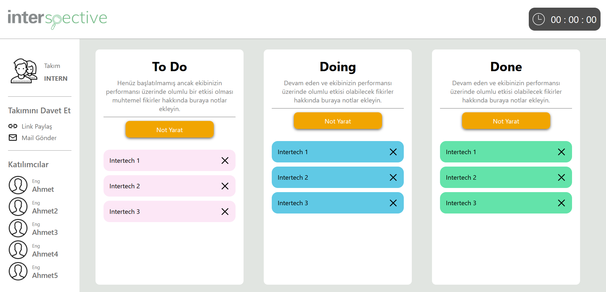
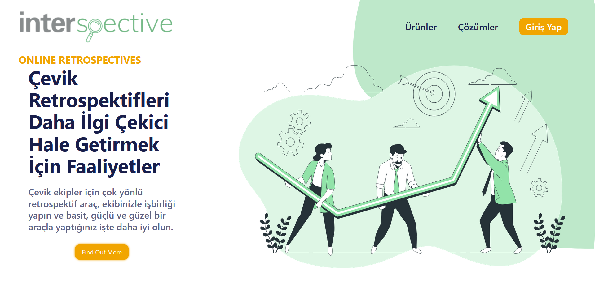
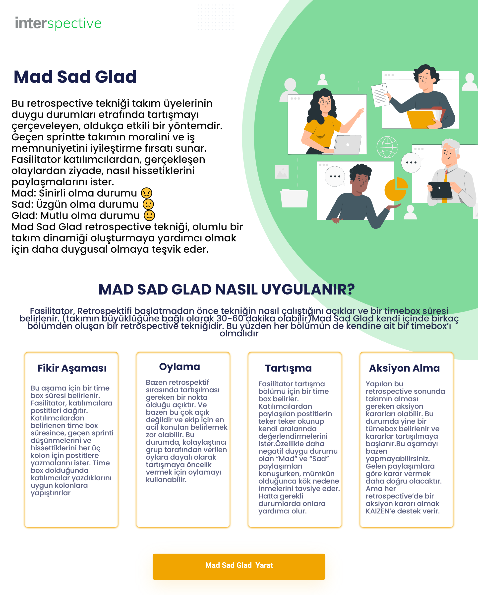
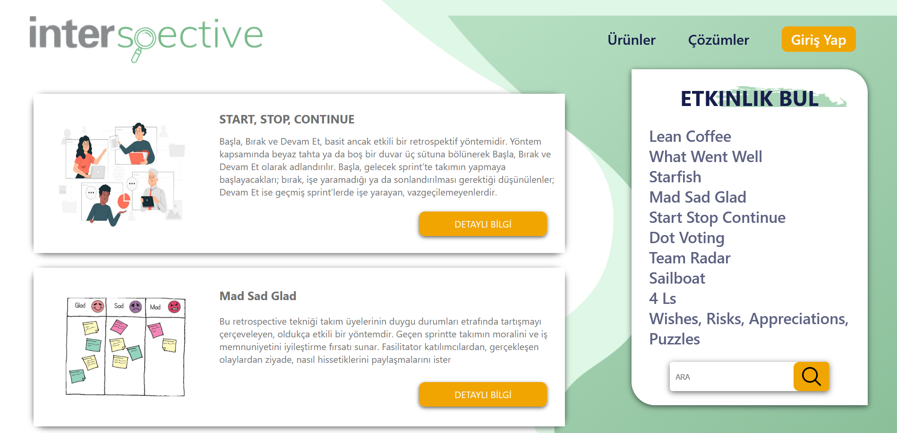
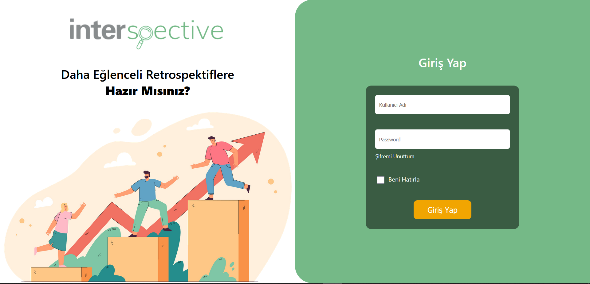

# Interspective-Retro-Website

This project was bootstrapped with [Create React App](https://github.com/facebook/create-react-app).
For installation; clone project, yarn install then yarn start.

## Note

It was requested to make a retrospective website used in the meetings held at the end of the sprint in the Scrum teams. Within the application, a selected retrospective tool was expected to be performed successfully.

With the end of my internship process, the development of the project was interrupted. The final version of the work done during the process was shared.

